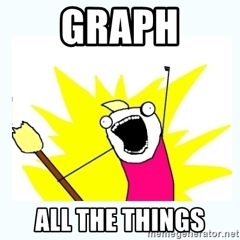
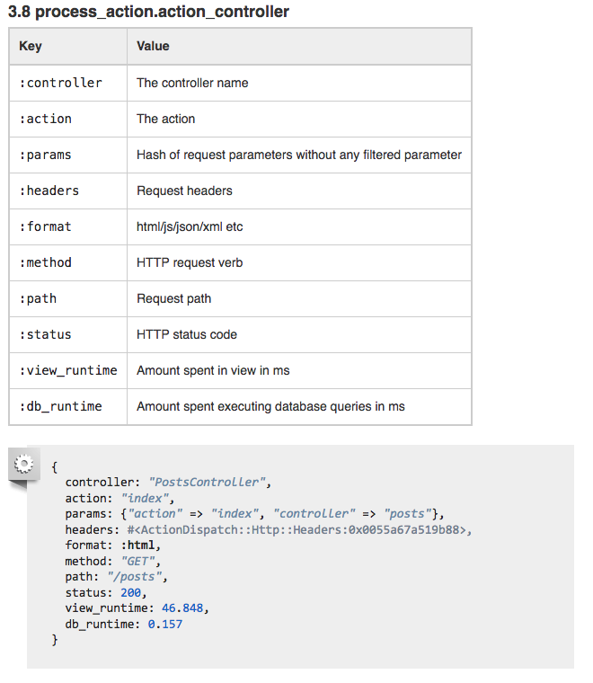

# Akkeris Metrics

> A tale of tracking down performance issues.

+++

### Akkeris Alerts

```
aka alerts:memory
aka alerts:5xxx
```

+++

### Grafana


+++



+++

### l2met

Turn these:
```ruby
$stdout.puts("measure#db.latency=4ms")
$stdout.puts("count#db.vaccum=1")
$stdout.puts("sample#db.size=100GB")
```

Into this:


+++

### Akkeris Metric Tagging

```ruby
$stdout.puts("measure#request.duration=4ms tag#controller=UsersController")
$stdout.puts("measure#request.duration=15ms tag#controller=UsersController")
$stdout.puts("measure#request.duration=64ms tag#controller=Companies")
```

+++

### Rails Instrumentation


